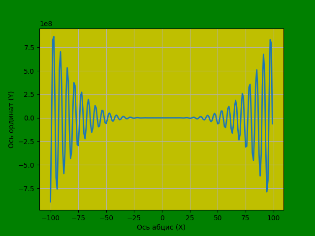
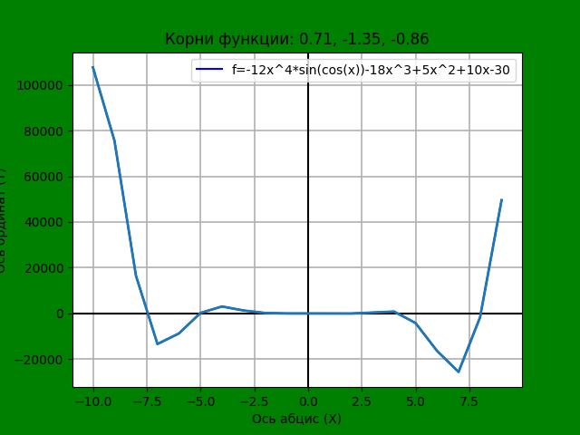

# Итоговое домашне задание

f(x) = -12x^4*sin(cos(x)) - 18x^3+5x^2 + 10x - 30
* Определить корни
* Найти интервалы, на которых функция возрастает
* Найти интервалы, на которых функция убывает
* Построить график
* Вычислить вершину
* Определить промежутки, на котором f > 0
* Определить промежутки, на котором f < 0

## Решение

1. Из графика выше понятно, что функция является немонотонной и имеет ***бесконечное количество корней***.
Для примера взят график для x=[-10,10,1] см.код

2. Интервалов на которых функция возрастает, так же бесконечное множество. 
На графике для x=[-10,10,1] заметны 3 возрастания функции: 
от (-б,998:-1,28e+04) до (-3,96:3,5e+0,3)
от (0:0) до (3,97:1,5e+0,3)
от (б,92:2,58e+04) до (9,02:5,07e+0,4)

3. Интервалов на которых функция убывает, так же бесконечное множество. 
На графике для x=[-10,10,1] заметны 3 убывания функции: 
от (-10,07 : 1,082e+05) до (6,997 : 1,28e+0,4)
от (-3,95 : 3,5e+03) до (0 : 0)
от (3,98 : 1,5e+03) до (6,91 : -2,58e+0,4)

4. График функции показан выше (рис,1)
График для x=[-10,10,1] можно посмотреть в коде и на рис.2

5. Количество вершин также бесконечное множество.
6. Количество промежутков где f > 0 бесконечное множество
7. Количество промежутков где f <> 0 бесконечное множество

